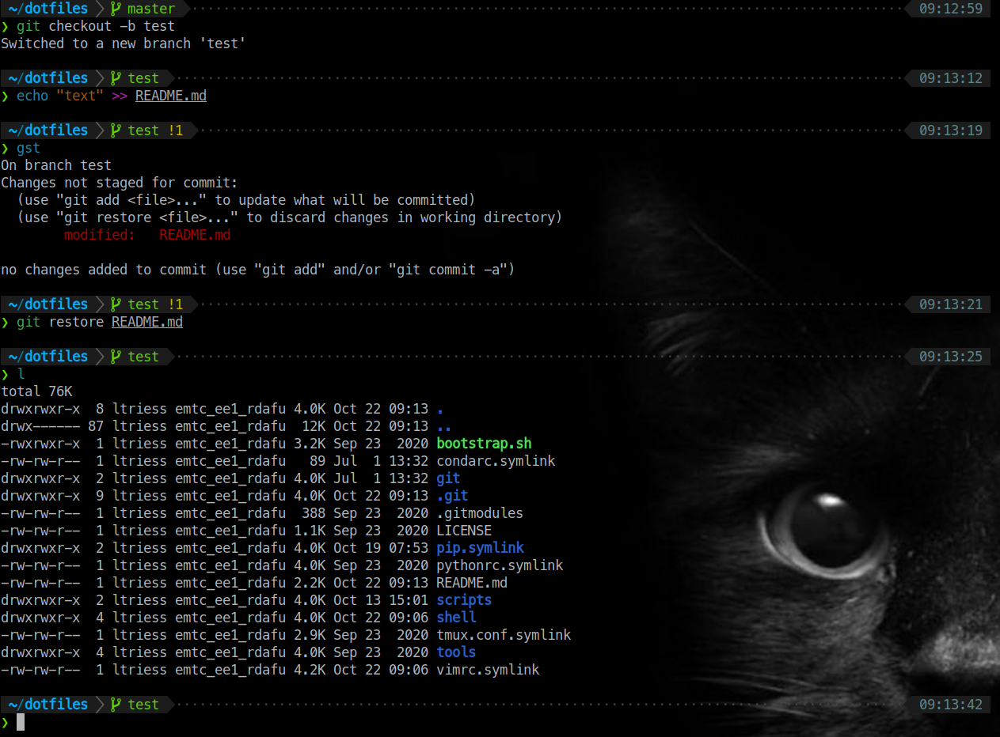

# Dotfiles
This repo if for my personal configurations for zsh, tmux, and vim.



## Install

Clone the repo and its submodules and then run the `bootstrap` script
```bash
git clone --recurse-submodules -j8 https://github.com/ltriess/dotfiles.git ~/dotfiles
cd ~/dotfiles
./bootstrap
```

For updating
```bash
cd ~/dotfiles
git pull
./bootstrap
```

## Dependencies

Before installing, make sure you have the following packages installed:
```
git vim tmux zsh
```

To correctly depict the prompt in your terminal, follow the instructions on how to install [Meslo Nerd Font](https://github.com/romkatv/powerlevel10k#meslo-nerd-font-patched-for-powerlevel10k).

To change the appearance of the prompt, type `p10k configure` to start the configuration wizard.
If there are any issues, refer to the instructions for [Powerlevel10k](https://github.com/romkatv/powerlevel10k).

Install further dependencies with
```bash
sudo apt-get install python3-pip
```

#### Powerline Python Package
Makes the `tmux` status bar as beautiful as the prompt.
The config assumes, it is installed in `/usr/local/lib/python3.8/dist-packages/powerline`.
If not, update path in `tmux.conf`.
```bash
sudo -H pip3 install powerline-status
sudo -H pip3 install powerline-gitstatus
```
If you do not want to install the powerline python package, remove the following lines from `tmux.conf`
```
run-shell "powerline-daemon -q"
source "/usr/local/lib/python3.8/dist-packages/powerline/bindings/tmux/powerline.conf"
```

## Tools

This is a list of tools that I find very useful and use frequently.

- [fasd](https://github.com/clvv/fasd)    `sudo apt-get install fasd`
- [fd](https://github.com/sharkdp/fd)    `sudo apt install fd-find`
- [fzf](https://github.com/junegunn/fzf)    `sudo apt-get install fzf`
- [lazygit](https://github.com/jesseduffield/lazygit)    `sudo apt-get install lazygit`
- [thefuck](https://github.com/nvbn/thefuck)    `pip3 install thefuck`
- [tldr](https://github.com/tldr-pages/tldr)    `pip3 install tldr`

